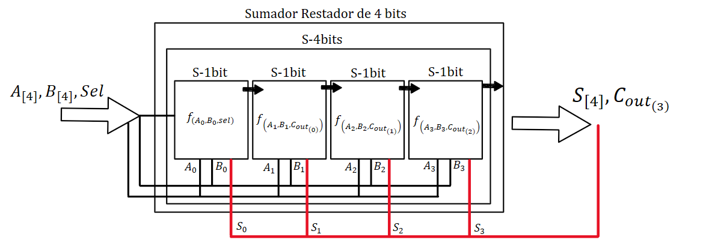
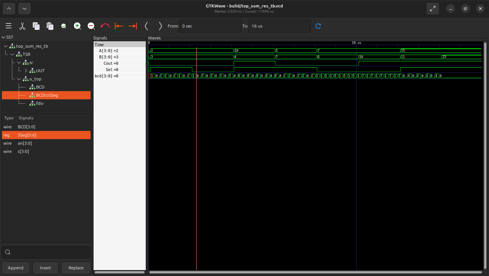
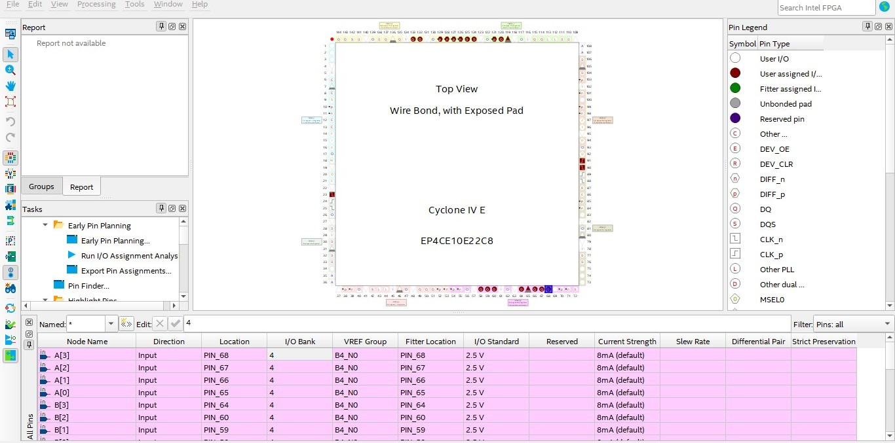
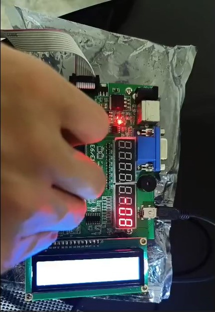

# Lab03: Decodificador BCD a 7segmentos

## Integrantes 

[Samuel David Negrete Lancheros](https://github.com/Snegunal)

[Alessandra Quintero Rois](https://github.com/Alequira)

[Jorge Alejandro Torres Gutierrez](https://github.com/DonTorres01)

## Informe

Indice:

1. [Diseño implementado](#1-diseño-implementado)
2. [Simulaciones](#2-descripción)
3. [Implementación](#3-diagramas)
4. [Simulaciones](#4-simulaciones)
5. [Implementación](#5-implementación)
6. [Conclusiones](#conclusiones)

## 1. Descripción

Este proyecto implementa un sistema digital capaz de realizar operaciones aritméticas (suma y resta) entre dos números de 4 bits, mostrando el resultado en un display de 7 segmentos utilizando conversión binaria a decimal (BCD) y multiplexado. El enfoque principal está en la traducción de valores binarios (de hasta 5 bits), provenientes de operaciones aritméticas, a su equivalente decimal, y su posterior representación visual clara y eficiente.. El diseño es completamente modular y se construye a partir de componentes básicos desarrollados en hardware descriptivo, facilitando su comprensión y reutilización.

## 2. Diseño implementado

### Divisor de Frecuencia

Este módulo toma una señal de reloj (clk) de alta frecuencia y la divide por un factor definido mediante un contador, generando una señal de menor frecuencia (clk2). Esto es fundamental para reducir la velocidad de visualización y permitir que el ojo humano perciba correctamente los dígitos en el display de 7 segmentos.

### Modulo BCD

Este módulo recibe una entrada binaria (inp) de hasta 5 bits (valor entre 0 y 31) y la convierte en valores BCD de un solo dígito. Utiliza un contador c para seleccionar dinámicamente cuál dígito mostrar en el display. Se usa el reloj dividido (clk2) para ir cambiando en cada flanco (postedge) entre digitos (unidades, decenas, ...); según el valor de c, calcula que digito corresponde, para este caso unidades: inp % 10, decenas: (inp - inp % 10) / 10. Así permite multiplexar varios dígitos con un solo módulo, usando solo una señal de control, ahorrando recursos lógicos y facilitando la lectura en pantallas múltiples.

Una de los elementos claves en este modulo es el wire new_in, ya que esta instrucción tiene como objetivo, dependiendo de los valores de Select[1:0] y Carry Out (inp[4]) -los cuales determinan si la operación del sistema es suma o resta, y si el valor del número es positivo o negativo, respectivamente- el poder preparar la salida inp para ser convertida y mostrada correctamente en el display.

La logìca detras de la variable new in, la cual nos representa el valor absoluto a mostrar, cuenta con 3 casos fundamentales:

- Para el caso donde el Sel == 1 y el inp[4]==0, se entiende un valor negativo, donde para la salida se le aplica el complemento a dos al inp[3:0] y se concatena un 0 para mantener la mangnitud.
- Para el caso donde el Sel == 1 y el inp[4] == 1, como el valor del numero es positivo, se toma directamente la magnitud del inp[3:0], y se le concatena un 0 para el bit más significativo.
- Para el ultimo caso, donde el Sel == 0, se utiliza el valor del inp[3:0] tal como esta, ya que no es necesaria la conversión.

### BCD a 7 segmentos

Este módulo transforma un valor BCD (0 a 9) en las señales que deben activarse para encender los segmentos correctos del display de 7 segmentos. Utiliza una instrucción case para cada valor de entrada del 0 al 9. La salida out es de 7 bits, cada uno representa un segmento (a, b, c, ..., g).

### Sumador (1-bit)

Este módulo constituye la unidad básica del sumador de 4 bits, y se conecta en cascada con otros sumadores de 1 bit para formar sistemas aritméticos de mayor tamaño.

Cada sumador de 1 bit realiza la operación:

- S = A ⊕ B ⊕ Cin  
- Cout = (A ∧ B) ∨ (Cin ∧ (A ⊕ B))

### Sumador restador (4-bits)

Este módulo realiza la operación principal del sistema: sumar o restar dos números de 4 bits (A y B) dependiendo de la señal de control sel.

- Si sel = 0, se suma A + B.

- Si sel = 1, se realiza A - B usando el complemento a 2 de B.

La salida incluye un bit de acarreo o préstamo ($C_{out}$) y un flag de overflow. Permite realizar operaciones aritméticas básicas con flexibilidad. Su forma es utilizando un sumador de 1 bit, luego instanciar 4 para suma de 4 bits, para volver a instanciar en un modulo de restador con el complemento a una entrada de 4 bits. 

## 3. Simulaciones 

Para implementar el módulo top_sum_res, encargado de la visualización y operación aritmética del sistema, se presentaron varios inconvenientes antes de llegar a la versión final. Uno de los primeros errores fue no considerar adecuadamente los casos necesarios en el módulo BCDtoSSeg para interpretar correctamente la entrada cuando se activaba el modo de resta. En una simulación inicial realizada en Verilog y visualizada con GTKWave, se ingresó únicamente el bit de acarreo/salida $C_{out}$ proveniente del sumador, junto con las unidades y decenas directamente al módulo BCD. Sin embargo, esto solo permitía visualizar sumas correctamente, ya que el bit de Cout, que indica el signo en el caso de una resta, no estaba siendo interpretado apropiadamente.

Cuando se activa la operación de resta, en caso de que $C_{out} = 0$ la salida representa un número negativo, pero en caso de que $C_{out} = 1$ El resultado era correcto sin embargo habia que cambiar ese 1 por un 0 para que BCD interpretara correctamente el número por lo tanto fue necesario ajustar la lógica del módulo BCD y considerar el complemento a dos para los resultados negativos. Adicionalmente se rediseñó el sistema para que el muestreo dinámico del display incluyera tres dígitos: las unidades, las decenas, y un signo representado mediante un segmento adicional que se activa si el número es negativo (cambiando para el anodo la logica de 0).

## 5. Implementación

Para la implementación en la FPGA, ya con la logíca anteriormente mencionada para cada uno de los modulos, se procedio a la asignación de los pines.

Para finalmente, tener la implementación fisica, donde en este caso se realizaron diversas pruebas, principalmente para poder mostrar el funcionamiento del signo, se realiza la suma y resta entre 0 y 15, donde se puede apreciar el cambio del signo y la suma entre varios valores.

## Conclusiones

1. **Diseño funcional del sistema de visualización aritmética:**  
   Se logró implementar de manera satisfactoria un sistema digital capaz de realizar operaciones aritméticas (suma y resta) entre dos números de 4 bits, visualizando correctamente el resultado en displays de 7 segmentos. Esto se cumplió mediante el desarrollo de una arquitectura modular que integra conversión BCD, multiplexado y control de segmentos.

2. **Comprensión y adaptación al tipo de display:**  
   Se tuvo en cuenta el tipo de display utilizado (ánodo común) para definir correctamente los niveles lógicos activos en las salidas del decodificador BCD a 7 segmentos, así como la lógica de selección de dígitos. Este paso fue esencial para garantizar una visualización adecuada del resultado en la tarjeta de desarrollo.

3. **Conversión binario a decimal con manejo de signo:**  
   Se desarrolló correctamente un sistema que transforma números binarios de hasta 5 bits en una representación decimal de dos dígitos (unidades y decenas), y adicionalmente un bit de signo. Este proceso requirió la comprensión del complemento a dos para la visualización de resultados negativos, diferenciando entre operaciones de suma y resta, y extrayendo la magnitud cuando era necesario.

