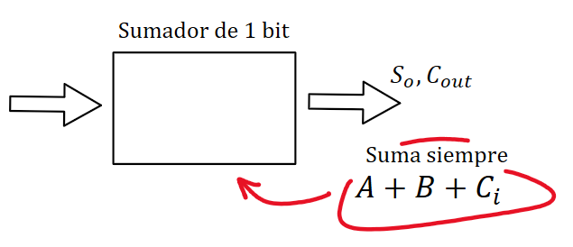

# Lab03: Decodificador BCD a 7segmentos

## Integrantes 

## Informe

Indice:

1. [Diseño implementado](#1-diseño-implementado)
2. [Simulaciones](#2-descripción)
3. [Implementación](#3-diagramas)
4. [Simulaciones](#4-simulaciones)
5. [Implementación](#5-implementación)
6. [Conclusiones](#conclusiones)

## 1. Diseño implementado

### Divisor de Frecuencia

Este módulo toma una señal de reloj (clk) de alta frecuencia y la divide por un factor definido mediante un contador, generando una señal de menor frecuencia (clk2). Esto es fundamental para reducir la velocidad de visualización y permitir que el ojo humano perciba correctamente los dígitos en el display de 7 segmentos.

### Modulo BCD

Este módulo recibe una entrada binaria (inp) de hasta 5 bits (valor entre 0 y 31) y la convierte en valores BCD de un solo dígito. Utiliza un contador c para seleccionar dinámicamente cuál dígito mostrar en el display. Se usa el reloj dividido (clk2) para ir cambiando en cada flanco (postedge) entre digitos (unidades, decenas, ...); según el valor de c, calcula que digito corresponde, para este caso unidades: inp % 10, decenas: (inp - inp % 10) / 10. Así permite multiplexar varios dígitos con un solo módulo, usando solo una señal de control, ahorrando recursos lógicos y facilitando la lectura en pantallas múltiples.

### BCD a 7 segmentos

Este módulo transforma un valor BCD (0 a 9) en las señales que deben activarse para encender los segmentos correctos del display de 7 segmentos. Utiliza una instrucción case para cada valor de entrada del 0 al 9. La salida out es de 7 bits, cada uno representa un segmento (a, b, c, ..., g).

### Sumador restador (4-bits)

Este módulo realiza la operación principal del sistema: sumar o restar dos números de 4 bits (A y B) dependiendo de la señal de control sel.

- Si sel = 0, se suma A + B.

- Si sel = 1, se realiza A - B usando el complemento a 2 de B.

La salida incluye un bit de acarreo o préstamo ($C_{out}$) y un flag de overflow. Permite realizar operaciones aritméticas básicas con flexibilidad. Su forma es utilizando un sumador de 1 bit, luego instanciar 4 para suma de 4 bits, para volver a instanciar en un modulo de restador con el complemento a una entrada de 4 bits. 

## 2. Descripción

## 3. Diagramas

## 4. Simulaciones 

Para implementar el módulo top_sum_res, encargado de la visualización y operación aritmética del sistema, se presentaron varios inconvenientes antes de llegar a la versión final. Uno de los primeros errores fue no considerar adecuadamente los casos necesarios en el módulo BCDtoSSeg para interpretar correctamente la entrada cuando se activaba el modo de resta. En una simulación inicial realizada en GTKWave, se ingresó únicamente el bit de acarreo/salida $C_{out}$ proveniente del sumador, junto con las unidades y decenas directamente al módulo BCD. Sin embargo, esto solo permitía visualizar sumas correctamente, ya que el bit de Cout, que indica el signo en el caso de una resta, no estaba siendo interpretado apropiadamente.

Cuando se activaba la operación de resta, se esperaba que $C_{out} = 1$ representara un número negativo. Para reflejar esto en la visualización, fue necesario ajustar la lógica del módulo BCD y considerar el complemento a dos para los resultados negativos. Se rediseñó entonces el sistema para que el muestreo dinámico del display incluyera tres dígitos: las unidades, las decenas, y un signo representado mediante un segmento adicional que se activa si el número es negativo (cambiando para el anodo la logica de 0).

La primera simulación funcional, sin el uso de Quartus, reflejó esta nueva lógica incorporando el signo sin la vizualización correcta para operaciones tanto de suma como de resta, parecia correcto pero no se veia en la FPGA.

## 5. Implementación

## Conclusiones

